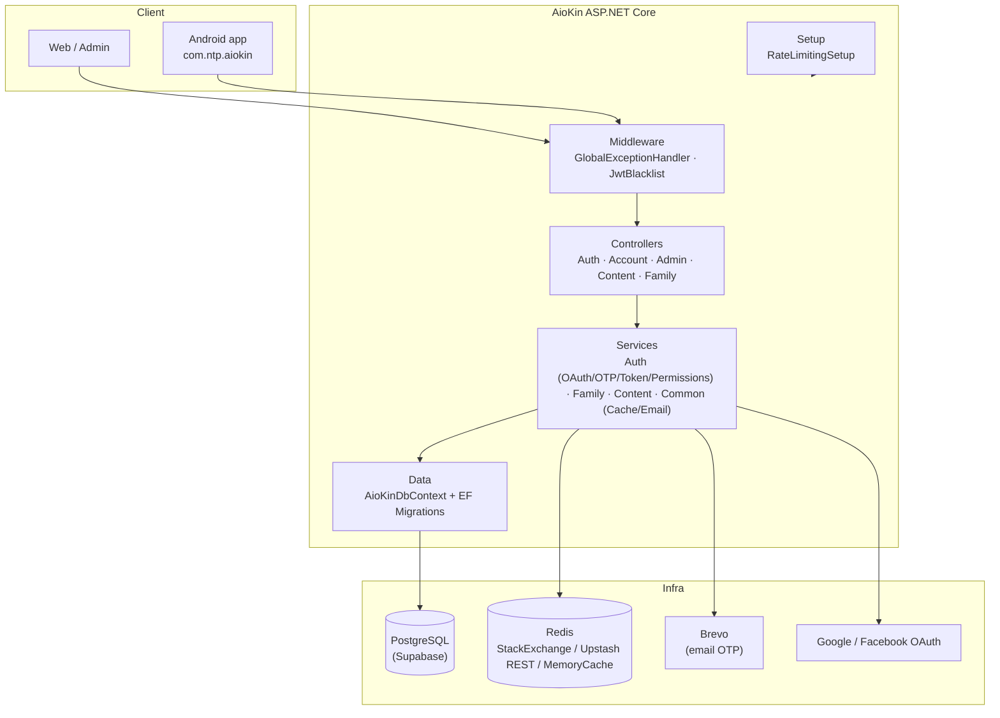
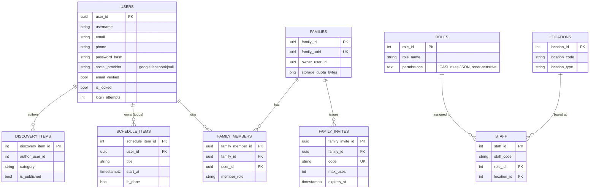

# AioKin — Project Overview

> Tai lieu tong quan kien truc. Doc truoc `docs/database.md` (chi tiet schema/migration) va
> `docs/ke-hoach-mo-rong.md` (roadmap M0-M8) khi can di sau.

## 1. AioKin la gi

Backend ASP.NET Core 9 phuc vu **web admin + app Android `com.ntp.aiokin`**: xac thuc nguoi
dung, ho gia dinh (family), noi dung kham pha + lich trinh ca nhan, va quan tri
nhan vien/nguoi dung. Repo dang o nhanh nen `feat/family-core` — moc M0 (them khai niem
"ho gia dinh") vua duoc gop, la nen mong cho cac tinh nang lon hon sap toi (chat, kho file,
chi tieu, QR thanh toan — xem `docs/ke-hoach-mo-rong.md`).

**Stack:** .NET 9 · EF Core 9 + Npgsql (PostgreSQL/Supabase) · Redis (StackExchange /
Upstash REST / MemoryCache, 3 tang) · JWT Bearer (access + refresh xoay vong) · OAuth2
Google & Facebook · Brevo (email OTP) · CASL-style permission rules · GitNexus (index/impact
analysis cho chinh repo nay).

> **Quyet dinh kien truc chot (khong doi):** Supabase **chi dung de host Postgres**
> (va Storage cho file/tiered content). **Toan bo auth la .NET thuan** — tu ky/quan ly
> access + refresh token, tu xu ly OTP/OAuth/biometric trong `AioKin/Services/Auth/**` —
> **khong dung Supabase Auth**, khong dung RLS dua tren `auth.uid()`. Phan quyen nam o
> tang API (`[Authorize]`, CASL/`IPermissionService`, `ISpaceContext`/`IFamilyContext`),
> khong nam trong Postgres. Xem `docs/auth-opaque-tokens-biometric.md` va muc 3.2 cua
> `docs/superpowers/specs/2026-09-25-promptvault-merge-design.md` (ly do RLS voi
> `auth.uid()` khong chay duoc trong kien truc nay).

## 2. Kien truc tang (`AioKin/`)

- **Controllers** (`Controllers/{Account,Admin,Auth,Content,Family}`) — mapping endpoint,
  khong chua logic nghiep vu.
- **Services** (`Services/{Auth,Common,Content,Family}`) — logic that (OTP, token
  rotation, permission CASL, family membership, cache 3-tang).
- **Data** (`Data/Entities`, `Data/Migrations`, `AioKinDbContext`) — EF Core la nguon su
  that duy nhat ve schema (xem canh bao muc 4).
- **Middleware** — xu ly loi tap trung (`OperationResult` → HTTP status) + kiem tra JWT bi
  thu hoi (blacklist theo `jti` trong Redis).
- **Setup** — cau hinh rate limiting (`auth`, `auth-strict`).

Chi tiet dependency/impact ở muc symbol, dung GitNexus (`impact`, `context`, `query`) thay
vi doc lai code — vi du cluster do GitNexus phat hien: **User, Family, OAuth, Email, Admin,
Content, Token, Otp, PasswordUser, ProfileUser, Cache**.

## 3. Data model that (theo EF Core migrations — nguon su that)

3 schema Postgres: **`security`** (`users`, `roles`, `staff`), **`core`**
(`locations`, `discovery_items` → `/posts`, `schedule_items` → `/todos`), **`family`**
(`families`, `family_members`, `family_invites` — them o migration `AddFamily`, M0).

Route `/posts`/`/todos` **co ten lech voi entity** (`DiscoveryItem`/`ScheduleItem`) — di
tich lich su tu app Android, doi mot ben la app 404 ngay (xem `README.md` muc Endpoint).

## 4. ⚠️ Canh bao: `db/init-postgres.sql` dang KHONG khop voi schema that

`db/init-postgres.sql` hien co thay doi **chua commit** (`git status` → `M`), va noi dung
sau khi sua la mot schema **hoan toan khac** — "PromptVault" (`vault.prompts`,
`vault.spaces`, `vault.tags`, schema `sync` cho dong bo SQLite↔Supabase). Schema nay:

- **Khong khop** voi EF Core models that (`AioKin/Data/Entities/**`) hay migrations
  (`InitialCreate`, `AddDiscoveryAndScheduleItems`, `AddFamily`).
- **Khong khop** voi `docs/database.md` (ban chinh no cung mo ta dung schema
  `core`/`security`/`family` o tren).
- File nay von phai la **output sinh tu lenh** `dotnet ef migrations script -o
  ../db/init-postgres.sql` (theo `docs/database.md` muc 2.1) — tuc la khong nen sua tay.

Overview va ER diagram o tren dung theo **migrations that** (nguon su that), khong dung
noi dung hien tai cua `db/init-postgres.sql`. Trươc khi commit, nen kiem tra lai xem thay
doi nay co phai gui nham noi dung/du an khac vao file, va can `git checkout -- db/init-postgres.sql`
roi sinh lai bang `dotnet ef migrations script` neu can cap nhat that.

## 5. Cac luong chinh (execution flows)

| Luong | Entry point | Ghi chu |
|---|---|---|
| Dang ky email + OTP | `POST /auth/register` → `verify-otp` | Chua tao `users` cho toi khi OTP dung |
| Login + refresh xoay vong | `POST /auth/login` / `/auth/refresh-token` | Access token blacklist theo `jti`; refresh la opaque token trong Redis |
| SSO Google/Facebook | `GET /auth/login/{provider}` → `/auth/finalize/{provider}` | Popup `postMessage` ve frontend sau khi xong |
| Quen mat khau | `forgot-password` → `verify-otp` → `reset-password` | 3 buoc, OTP rieng voi buoc dang ky |
| Quan tri nguoi dung/nhan vien | `/admin/users/**`, `/admin/staff/**` | Phan quyen theo role Staff/Admin/SuperAdmin |
| Kham pha + lich trinh | `/posts`, `/todos` | Phuc vu rieng app Android, khong boc `OperationResult` o duong thanh cong |
| Phan quyen CASL | `/ability/rules` | Doc `security.roles.permissions`, thu tu rule la ngu nghia |
| Ho gia dinh (M0, moi) | `/family/**` (`FamiliesController`) | Tao/tham gia gia dinh qua invite code, chuan bi cho M1+ (chat, kho file, chi tieu...) |

Dung `query({search_query: "..."})` hoac doc `gitnexus://repo/AioKin/process/{name}` de xem
tung buoc chi tiet cua tung luong (GitNexus da index 121 execution flow / 1448 symbol).

## 6. Roadmap (tom tat `docs/ke-hoach-mo-rong.md`)

M0 (family-core, vua xong) la nen mong bat buoc cho moi moc sau: chat realtime (SignalR +
Redis backplane), kho file gia dinh (`IFileStorage` → Cloudflare R2), quan ly chi tieu
(`Expense.FamilyID` nullable = ca nhan/chung), todo gan calendar, va bo QR (tao/thanh
toan/quet — sinh chuoi VietQR o server). Job nen dung Hangfire + Postgres storage. Chi tiet
quyet dinh kien truc va quy uoc bat buoc (SubjectType, thu tu rule CASL...) nam trong file do.

## 7. Doc tiep theo

| Can biet | Doc |
|---|---|
| Chi tiet schema, cach khoi tao/migrate DB, cac bay da gap | `docs/database.md` |
| Ke hoach mo rong, quyet dinh kien truc M0-M8 | `docs/ke-hoach-mo-rong.md` |
| Opaque access/refresh token, quan ly phien, dang nhap sinh trac hoc | `docs/auth-opaque-tokens-biometric.md` + 3 plan trong `docs/superpowers/plans/2026-09-25-*.md` |
| Quy uoc git/commit/branch | `docs/git-flow.md` |
| Endpoint day du, bien moi truong, ghi chu thiet ke | `README.md` |
| Kien truc/blast-radius o muc symbol | GitNexus (`query`, `context`, `impact` — xem `CLAUDE.md`) |
